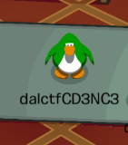

# Mancala Meetup
> Cadence wanted to meet me to play a game of mancala, but she got cold on the way there so she stopped for coffee. She said she'll wait at the cafe for me, I think I'll try something new when I get there.

## Part 1: Wait what?
Yep, that description is all we got to go off of. 
Now, if you were lucky and had an amazing childhood like me, this description may remind you of something; Club Penguin, The MMO of many people's childhoods.
Sounds like a crazy jump, but there are quite a few hints that point towards Club Penguin:
- [**Cadence**](https://clubpenguin.fandom.com/wiki/Cadence) is a celebrity on Club Penguin. If you were lucky, you could actually meet her on some special occasions!
- [**Mancala**](https://clubpenguin.fandom.com/wiki/Mancala) was one of the two-player minigames you could play within Club Penguin.
- **"she got cold"** refers to Club Penguin taking place on a frozen island covered in snow and ice. Penguins do live in Antarctica afterall, and that place is pretty damn cold
- **"she stopped for coffee"** and **"she'll wait a the cafe"** hints towards the [**Coffee Shop**](https://clubpenguin.fandom.com/wiki/Coffee_Shop) that you can visit in Club Penguin's Town Center. The second floor of the coffee shop is one of the few places you can play Mancala, so that gives us a target location!

Yes, those of us who have played Club Penguin before have a bit of an advantage, but you can see results for Club Penguin pop up on Google if you search certain key words together, such as "Cadence mancala meetup". Takes a bit more searching, but it's possible to find.

For a bonus hint, the challenge was announced to be "down" for ~30 minutes at during the competition, so that implies the existence of something (or *someone* \*wink wink nudge nudge\*) that we need to find/interact with.
So, we likely have to hop on Club Penguin and meet someone on the second floor of the Coffee Shop right?

## Part 2: I hate Disney
Only problem with that is that the original Club Penguin died.
Disney killed it like it does many people's dreams and childhoods. BUT!!!
While the original may be gone, there's still private servers that keep the fandom alive and able to relive the memories.
Only thing to do now is find which one to go to out of the [~25 active private servers](https://cpps.fandom.com/wiki/Private_Server_List). 

Thankfully, we don't have to run around like headless chickens (penguins?) trying to find which one. 
The "try something **new**" hints towards a private server called [New Club Penguin](https://newcp.net/).
From there, all you had to do was make a penguin, check out the second floor of the Coffee Shop, and boom! 
Penguin flag located.

